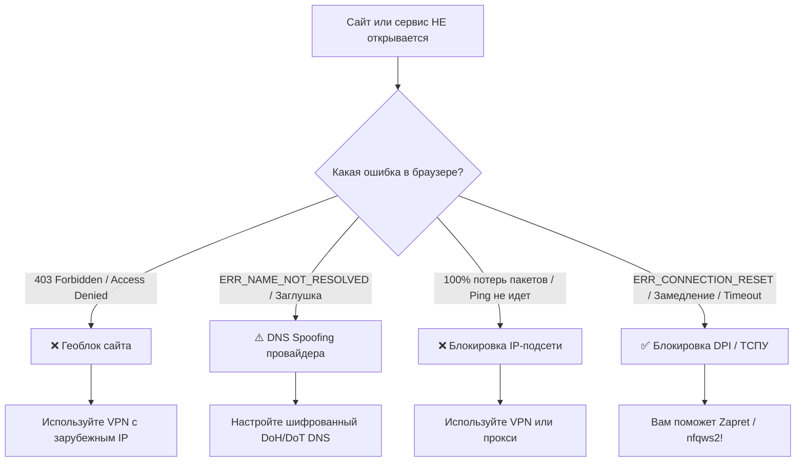

Когда конкретный сайт или сервис перестает открываться, не спешите запускать наугад все настройки. Воспользуйтесь простой пошаговой инструкцией, чтобы определить точную причину недоступности.

---

## 🗺 Пошаговая блок-схема диагностики



---

## 🔍 Подробный разбор 4 шагов проверки

### Шаг 1: Проверка на Геоблок
- **Симптомы**: Страница загружается, но на ней написано `403 Forbidden`, `Access Denied`, `Service is not available in your region`.
- **Вердикт**: Сайт заблокировал российские IP-адреса. **Zapret не поможет**, включите VPN.

### Шаг 2: Проверка DNS-подмены (DNS Spoofing)
- **Симптомы**: Браузер пишет `ERR_NAME_NOT_RESOLVED`, либо вместо сайта открывается страница-заглушка провайдера с текстом «Доступ ограничен».
- **Причина**: Провайдер перехватывает обычные DNS-запросы и отдает вам фальшивый IP-адрес.
- **Вердикт**: **Zapret сработает только после настройки шифрованного DNS** (DoH/DoT). Подробнее читайте в [Статье 04 о настройке DNS](/docs/zapret-nfqws/04-dns-and-spoofing/).

### Шаг 3: Проверка блокировки по IP-адресу
- **Симптомы**: Откройте командную строку (CMD / Terminal) и выполните ping до IP-адреса сайта:
  ```bash
  ping 1.1.1.1
  ```
- **Причина**: Если абсолютно все пакеты теряются (`100% loss`), провайдер полностью заблокировал маршрут к этому IP-адресу на сетевом уровне (null-routing).
- **Вердикт**: Через заблокированный IP-адрес пакеты физически не могут пройти. **Zapret не поможет**, нужен VPN или прокси.

### Шаг 4: Проверка блокировки DPI / ТСПУ
- **Симптомы**:
  - При попытке зайти на сайт соединение мгновенно сбрасывается (`ERR_CONNECTION_RESET`).
  - Видео на YouTube бесконечно крутят индикатор загрузки (замедление).
  - Голосовые каналы Discord не подключаются или висят в статусе «Подключение к RTC».
- **Вердикт**: **Это идеальный случай для Zapret!** ТСПУ реагирует на SNI/заголовки. Правильно подобранная стратегия Zapret полностью восстановит доступ и скорость.

---

## 📋 Итоговый чек-лист перед настройкой Zapret

1. Убедитесь, что проблема **не в геоблоке**.
2. Включите в браузере или на роутере **шифрованный DNS (DoH/DoT)**.
3. Запустите инструмент подбора стратегий (см. [Статью 06 про blockcheckw](/docs/zapret-nfqws/06-blockcheck-guide/)).
