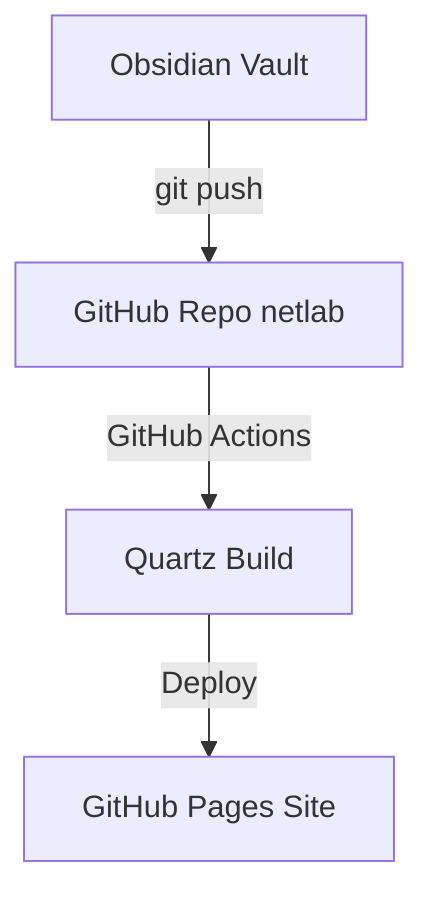

# 📝 Как вести заметки в Obsidian для NetLab

Эта база знаний построена так, чтобы вы могли писать статьи в десктопной программе **Obsidian** и автоматически обновлять сайт через Git.

---

## 🔗 Двусторонние ссылки (Backlinks)

В Obsidian статьи связываются между собой через двойные квадратные скобки:
- Ссылка на [[Основы компьютерных сетей]]
- Ссылка на [[Развертывание в Docker]]

Когда вы делаете такую ссылку, Quartz автоматически создает обратную связь (Backlink) в нижней части статьи.

---

## 🎨 Выноски (Callouts)

Вы можете использовать стандартные выноски Obsidian:

> [!INFO] Информация
> Выноски подсвечиваются соответствующими цветами в темной и светлой теме.

> [!CHECK] Завершенная задача
> Сайт настроен и готов к интеграции с GitHub Pages.

---

## 📊 Диаграммы Mermaid

Quartz поддерживает отрисовку диаграмм Mermaid прямо из markdown:

Вернуться на [[🚀 NetLab — База знаний и Гайды|Главную страницу]].
