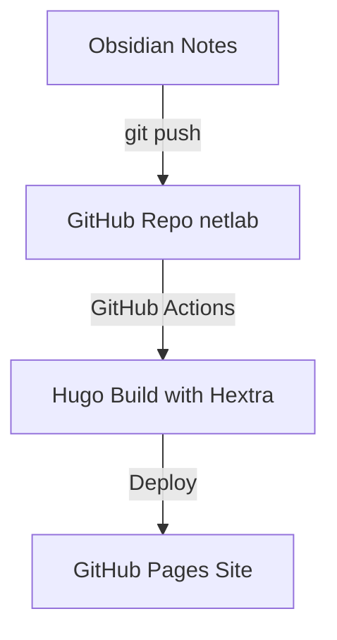

# 📝 Ведение заметок в Obsidian

Вы можете удобно составлять материалы в Obsidian и выгружать их на данный сайт Hextra.

---

## 🎨 Выноски (Callouts) в Hextra

Тема Hextra поддерживает стильные выноски:


**Информация:** Выноска подсвечивается синим цветом.



**Предупреждение:** Выноска подсвечивается желтым цветом.


---

## 📊 Диаграммы Mermaid

Hextra поддерживает визуализацию Mermaid из коробки:

